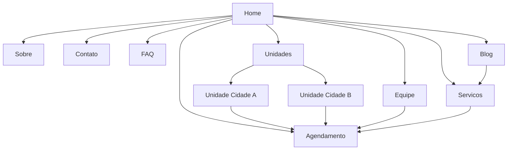

# Guia Pratico de Design e Conteudo para Site de Barbearia

## Resumo Executivo

Um site de barbearia que converte funciona como motor de agendamento com forte relevancia local.  
O objetivo principal e reduzir o tempo entre a entrada no site e a confirmacao:

1. Escolher unidade.
2. Escolher servico (com preco e duracao).
3. Escolher profissional (ou "qualquer um").
4. Escolher horario.
5. Confirmar.

Para duas unidades em cidades vizinhas, a melhor abordagem e um dominio unico com:

- Hub de unidades (`/unidades`).
- Uma pagina completa por unidade (`/unidades/cidade-a`, `/unidades/cidade-b`).
- Conteudo realmente local em cada pagina (nao apenas trocar nome da cidade).

## Arquitetura de Informacao

### Hierarquia Recomendada

| Pagina | Objetivo principal | Conteudo minimo | CTA dominante |
|---|---|---|---|
| Home | Explicar proposta e converter rapido | Hero, beneficios, servicos, unidades, prova social | Agendar agora |
| Servicos | Tirar duvidas de escopo/preco/tempo | Lista de servicos, preco, duracao, inclusoes | Agendar servico |
| Sobre | Construir confianca | Historia, valores, higiene, diferenciais | Ver equipe / agendar |
| Equipe | Afinidade com barbeiro | Bio, especialidade, estilo, fotos | Agendar com profissional |
| Agendamento | Concluir tarefa | Fluxo completo de reserva | Confirmar agendamento |
| Contato | Remover friccao | Telefone, WhatsApp, mapa, horarios, estacionamento | Ligar / Como chegar |
| FAQ | Reduzir suporte | Cancelamento, atrasos, pagamento, no-show | Agendar / Falar com atendente |
| Blog | SEO e autoridade | Conteudo local e de cuidados | Ver servicos / agendar |
| Unidades | Escolha por cidade | Cards com NAP e horarios | Escolher unidade |
| Pagina de unidade | Conversao local | NAP completo, mapa, equipe local, galeria, reviews | Agendar nesta unidade |

### Mapa do Site (Mermaid)



## Navegacao e Conversao

- Menu desktop: `Servicos`, `Unidades`, `Equipe`, `Sobre`, `FAQ`, `Contato`, botao persistente `Agendar`.
- Mobile: menu compacto com CTA de agendamento sempre visivel (header ou botao fixo no rodape).
- Um CTA primario por tela.
- Texto de link explicito (evitar "clique aqui").
- Footer com links de apoio para navegacao secundaria.

## Layout Responsivo

### Padrão de Grid

- Mobile: 4 colunas.
- Tablet: 8 colunas.
- Desktop: 12 colunas.
- Gutter: 24px.
- Margem externa sugerida: 24-40px conforme largura.

### Breakpoints

- `<576px`: mobile.
- `>=768px`: tablet.
- `>=992px`: desktop.
- `>=1200px`: desktop amplo.

### Tokens CSS Base

```css
:root {
  /* Spacing */
  --space-0: 0px;
  --space-1: 4px;
  --space-2: 8px;
  --space-3: 12px;
  --space-4: 16px;
  --space-5: 20px;
  --space-6: 24px;
  --space-8: 32px;
  --space-10: 40px;
  --space-12: 48px;
  --space-14: 56px;
  --space-16: 64px;

  /* Layout */
  --container-max: 1140px;
  --gutter: 24px;
  --radius-sm: 8px;
  --radius-md: 12px;
  --radius-lg: 16px;

  /* Typography */
  --font-body: "Inter", system-ui, -apple-system, "Segoe UI", Roboto, Arial, sans-serif;
  --font-heading: "Oswald", "Inter", system-ui, sans-serif;

  --text-sm: 0.875rem; /* 14px */
  --text-md: 1rem; /* 16px */
  --text-lg: 1.25rem; /* 20px */

  --h1: 2.5rem; /* 40px */
  --h2: 2rem; /* 32px */
  --h3: 1.5rem; /* 24px */
  --h4: 1.25rem; /* 20px */
  --h5: 1rem; /* 16px */
  --h6: 0.875rem; /* 14px */

  --lh-tight: 1.2;
  --lh-body: 1.5;
}
```

## Wireframe de Home (Texto)

```text
[HEADER]
Logo | Servicos | Unidades | Equipe | FAQ | Contato | [AGENDAR]

[HERO]
H1 + proposta de valor curta
[Agendar agora] [Ver servicos]

[PROVA SOCIAL]
Nota media | numero de avaliacoes | anos de experiencia | higiene

[SERVICOS]
Cards com preco inicial + duracao + inclusoes + CTA

[UNIDADES]
Cidade A [Agendar] [Como chegar]
Cidade B [Agendar] [Como chegar]

[EQUIPE]
3-4 perfis com especialidade + CTA

[FAQ CURTO]
4-6 perguntas + link para FAQ completo

[FOOTER]
NAP por unidade + horarios + politicas + redes
```

## Tipografia

| Token | Tamanho | Line-height | Uso |
|---|---:|---:|---|
| Body | 16px | 1.5 | Texto corrido |
| Small | 14px | 1.43-1.5 | Labels e microcopy |
| H1 | 40px | 1.2 | Hero |
| H2 | 32px | 1.25 | Titulos de secao |
| H3 | 24px | 1.3 | Sub-secoes |
| H4 | 20px | 1.4 | Cards |
| H5 | 16px | 1.5 | Titulos menores |
| H6 | 14px | 1.5 | Overlines |

### Pareamentos de Fonte (Google Fonts)

1. Oswald + Inter.
2. Bebas Neue + Source Sans 3.
3. Barlow Condensed + Barlow.
4. Montserrat + Open Sans.
5. Cinzel (titulos) + DM Sans (corpo).

## Paletas de Cor (HEX)

| Nome | Cores |
|---|---|
| Heritage carvao + dourado | `#0B0D10`, `#F5F2E9`, `#B08D57`, `#7A1F1F`, `#2E2E2E` |
| Navy + cobre | `#0A1B2B`, `#F6F1E7`, `#B46A3C`, `#1F2933`, `#3E4C59` |
| Verde garrafa + bege | `#0F2A1D`, `#E9E2D0`, `#C2A26C`, `#1A1A1A`, `#6B7280` |
| Preto + vermelho profundo | `#0F0F10`, `#FAFAFA`, `#8B1E1E`, `#C7C7C7`, `#2B2B2B` |
| Cinza aco + azul petroleo | `#111827`, `#F9FAFB`, `#0E7490`, `#334155`, `#A3A3A3` |

Regra pratica: use uma unica cor de destaque para CTA e links.

## Conteudo que Gera Confianca

- Equipe com foto real, especialidade e experiencia.
- Servicos com preco e duracao transparentes.
- Politicas claras de cancelamento, atraso e no-show.
- Avaliacoes reais com volume e nota media.
- Galeria da unidade (ambiente real e resultados reais).
- Informacoes locais objetivas (estacionamento, acessibilidade, horarios).

## SEO Local para Duas Unidades

### Estrutura recomendada de URL

- `/unidades` (hub).
- `/unidades/cidade-a`.
- `/unidades/cidade-b`.

Evitar:

- Paginas quase identicas por cidade apenas para ranquear.
- Multiplicar variacoes sem utilidade real para o usuario.

### Conteudo obrigatorio em cada pagina de unidade

- NAP completo (nome, endereco, telefone).
- Horarios atualizados.
- Mapa e rotas.
- Equipe local.
- Galeria local.
- FAQ local (se regras diferirem).

### Canonicalizacao

- Use canonical para parametros (`utm_*`) e URLs duplicadas.
- Nao canonicalize `cidade-a` para `cidade-b`.
- Mantenha links internos apontando para a URL canonica.

## Dados Estruturados (JSON-LD)

Exemplo minimo por unidade:

```html
<script type="application/ld+json">
{
  "@context": "https://schema.org",
  "@type": "Barbershop",
  "@id": "https://exemplo.com/unidades/cidade-a#barbershop",
  "name": "Barbearia Exemplo - Cidade A",
  "url": "https://exemplo.com/unidades/cidade-a",
  "telephone": "+55-11-99999-9999",
  "address": {
    "@type": "PostalAddress",
    "streetAddress": "Rua Exemplo, 123",
    "addressLocality": "Cidade A",
    "addressRegion": "SP",
    "postalCode": "00000-000",
    "addressCountry": "BR"
  },
  "openingHoursSpecification": [
    {
      "@type": "OpeningHoursSpecification",
      "dayOfWeek": ["Monday","Tuesday","Wednesday","Thursday","Friday"],
      "opens": "09:00",
      "closes": "19:00"
    }
  ],
  "sameAs": [
    "https://www.instagram.com/sua-barbearia"
  ]
}
</script>
```

## Acessibilidade (Checklist Minimo)

- Contraste de texto: 4.5:1 (texto normal) e 3:1 (texto grande).
- Navegacao por teclado com foco visivel.
- Alvos clicaveis com minimo de 24x24 px.
- Labels associados corretamente aos campos.
- Mensagens de erro claras e proximas aos campos.
- `alt` em imagens informativas; decorativas com `alt=""`.
- Zoom ate 200% sem perda de funcionalidade.

## Performance (Checklist Minimo)

Metas:

- LCP <= 2.5s.
- INP < 200ms.
- CLS < 0.1.

Acoes:

- Nao usar `loading="lazy"` na imagem hero/LCP.
- Definir `width` e `height` de imagens para reduzir CLS.
- Usar `srcset`/`sizes`.
- Preferir WebP/AVIF.
- Fazer lazy loading apenas em imagens fora da dobra.
- Reduzir JS de terceiros.
- Monitorar Search Console e PageSpeed Insights.

## Fluxo de Agendamento

1. Unidade.
2. Servico (preco + duracao).
3. Profissional (ou "qualquer um disponivel").
4. Data e horario.
5. Nome + telefone.
6. Confirmacao.

Campos minimos no formulario inicial:

- Nome.
- Telefone (WhatsApp, se aplicavel).
- Unidade.
- Servico.

## Analytics (GA4 + GTM)

Eventos recomendados:

- `view_service`
- `select_location`
- `begin_booking`
- `complete_booking`
- `click_call`
- `click_whatsapp`
- `click_directions`
- `view_team_member`
- `book_with_barber`

Exemplo `dataLayer`:

```html
<script>
  window.dataLayer = window.dataLayer || [];
  function trackEvent(eventName, payload) {
    window.dataLayer.push({
      event: eventName,
      ...payload
    });
  }

  // Exemplo:
  // trackEvent("begin_booking", { location: "cidade-a", service: "corte" });
</script>
```

## Privacidade e LGPD (Operacional)

- Banner de consentimento com opcao de aceitar e recusar.
- Bloqueio de tags nao essenciais antes do consentimento.
- Politica de privacidade e cookies atualizada.
- Registro de preferencias de consentimento.
- Revisao juridica quando houver ads, remarketing e integracoes externas.

## Plano de Implementacao (4 Sprints)

### Sprint 1

- Definir identidade visual (tipografia, paleta, componentes).
- Implementar layout base responsivo (header, hero, cards, footer).
- Publicar paginas essenciais: Home, Servicos, Unidades, Contato.

### Sprint 2

- Implementar paginas de unidade completas.
- Implementar fluxo de agendamento (MVP).
- Adicionar FAQ e bloco de prova social.

### Sprint 3

- Implementar dados estruturados por unidade.
- Ajustar canonical/sitemap/meta tags.
- Configurar eventos GA4/GTM e painel de conversao.

### Sprint 4

- Otimizacao de Core Web Vitals.
- Auditoria de acessibilidade.
- Refino de copy e CRO (CTA, ordem de secoes, microcopy).

## Checklist de Lancamento

- [ ] CTA de agendamento visivel em todas as paginas principais.
- [ ] Conteudo de servicos com preco e duracao.
- [ ] Paginas de unidade com NAP completo e mapa.
- [ ] JSON-LD valido por unidade.
- [ ] Canonical coerente e sem conflito.
- [ ] Sitemap enviado e indexacao monitorada.
- [ ] Contraste, foco, labels e alvos validados.
- [ ] LCP/INP/CLS em nivel aceitavel no percentil 75.
- [ ] Eventos de conversao coletados corretamente.
- [ ] Banner de consentimento e politicas publicados.

## Referencias Oficiais para Consulta Continua

- Google Search Central (SEO basico, canonicalizacao, mobile-first).
- Google Core Web Vitals e PageSpeed Insights.
- Schema.org (`Barbershop`, `LocalBusiness`, `PostalAddress`).
- WCAG 2.2 e materiais WAI para formularios e erros.
- Documentacao GA4/GTM para eventos e `dataLayer`.
- LGPD (Lei 13.709/2018) e orientacoes da ANPD.
